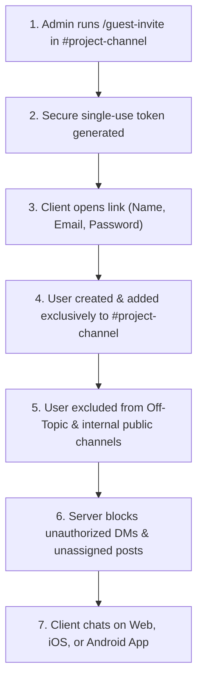

# Mattermost Guest Auto-Isolation Plugin

[](https://golang.org)
[](LICENSE)
[](https://mattermost.com)
[](https://github.com/kazimshah39/mattermost-plugin-guest-isolation)

A lightweight, powerful server plugin for **Mattermost Team Edition** (and Enterprise) that enables seamless, secure client onboarding with **1-click tokenized invite links**, **ultra-simple 3-field signup**, **automatic channel isolation**, and **cross-channel / DM protection** — without breaking official Mobile and Desktop app compatibility.

---

## 🎯 Why This Plugin?

In standard Mattermost, **Guest Accounts** are locked behind expensive paid Enterprise licenses ($10+/user/month). On the free Team Edition:
* Every user who joins is automatically placed in public company channels (*Town Square*, *Off-Topic*).
* Clients can discover other clients and internal staff in the member directory.
* Clients can send direct messages to anyone.

**The Guest Auto-Isolation Plugin fixes this completely:**
* Generates secure, single-use client invitation links with `/guest-invite`.
* Presents an embedded, responsive 3-field signup form (**Full Name**, **Email**, **Password**).
* Auto-provisions the user and **locks them exclusively into the target project channel**.
* Intercepts and **blocks unauthorized posts** in other channels and **blocks private direct messages**.
* Fully compatible with the **official Mattermost Mobile App (iOS / Android)**, **Desktop App**, and **Web App**.

---

## 🏗️ Architecture & How It Works



---

## ✨ Features

- **⚡ 1-Click Client Invitations:** Generate secure, single-use invite tokens directly inside any channel with `/guest-invite`.
- **📝 Simple 3-Field Signup:** Fast, mobile-friendly registration page (Name, Email, Password).
- **🔒 Automatic Channel Isolation:** Users are added exclusively to their designated project channel and removed from default public channels.
- **🚫 DM & Cross-Channel Protection:** Server-level interceptors block clients from posting in unassigned channels or starting private direct messages.
- **📱 100% Official App Support:** Provisioned users have standard credentials and can immediately log in from the official **Mattermost iOS App**, **Android App**, and **Desktop App**.
- **🔔 Offline Email Alerts:** Full support for SMTP notifications when clients are mentioned while offline.
- **📦 Zero External Dependencies:** Standalone Go plugin using official Mattermost Server APIs.

---

## 🚀 Installation

### Option 1: Upload via Mattermost System Console (Recommended)

1. Download the latest `com.custom.guest-isolation-x.x.x.tar.gz` from the [Releases](https://github.com/kazimshah39/mattermost-plugin-guest-isolation/releases) page.
2. In Mattermost, go to **System Console** > **Plugins** > **Plugin Management**.
3. Under **Upload Plugin**, choose the `.tar.gz` file and click **Upload**.
4. Find **Guest Auto-Isolation Plugin** in the list and click **Enable**.

### Option 2: Install via `mmctl` CLI

```bash
# Upload and enable
mmctl plugin add com.custom.guest-isolation-0.1.0.tar.gz --local
mmctl plugin enable com.custom.guest-isolation --local
```

---

## 📖 Usage Guide

### 1. Generating an Invitation Link
In the private channel where you want your client to collaborate (e.g. `#acme-portal`), run:
```text
/guest-invite
```
The plugin responds with an ephemeral message containing the link:
```text
### 🔗 Client Invite Link Generated
Channel: #Acme Corp Portal
Invite URL: http://your-mattermost-server.com/plugins/com.custom.guest-isolation/signup?token=747744ae-1c49-4bd4-98b9-de8b1636467d
```

### 2. Client Registration
1. Send the URL to your client.
2. The client opens the link, enters their **Full Name**, **Email**, and **Password**, and clicks **Create Account & Join Chat**.
3. The client is immediately added to the project channel.

### 3. Client Mobile & Desktop Login
Clients can download the official **Mattermost App** from the Apple App Store or Google Play Store, enter your server URL, and log in with their email and password.

---

## 🛠️ Building from Source

### Prerequisites
* Go `1.22` or higher
* `make` and `tar`

### Build Binaries & Package Release Bundle
```bash
# Clone the repository
git clone https://github.com/kazimshah39/mattermost-plugin-guest-isolation.git
cd mattermost-plugin-guest-isolation

# Run unit tests
make test

# Build multi-architecture binaries and package tarball
make bundle
```
The compiled bundle will be output as `com.custom.guest-isolation-0.1.0.tar.gz`.

---

## 🧪 Running Unit Tests

```bash
go test -v ./server/...
```

---

## 🤝 Contributing

Contributions, issues, and feature requests are welcome! Feel free to check the [issues page](https://github.com/kazimshah39/mattermost-plugin-guest-isolation/issues).

1. Fork the Project
2. Create your Feature Branch (`git checkout -b feature/AmazingFeature`)
3. Commit your Changes (`git commit -m 'Add some AmazingFeature'`)
4. Push to the Branch (`git push origin feature/AmazingFeature`)
5. Open a Pull Request

---

## 📄 License

Distributed under the **Apache License 2.0**. See [`LICENSE`](LICENSE) for more information.
